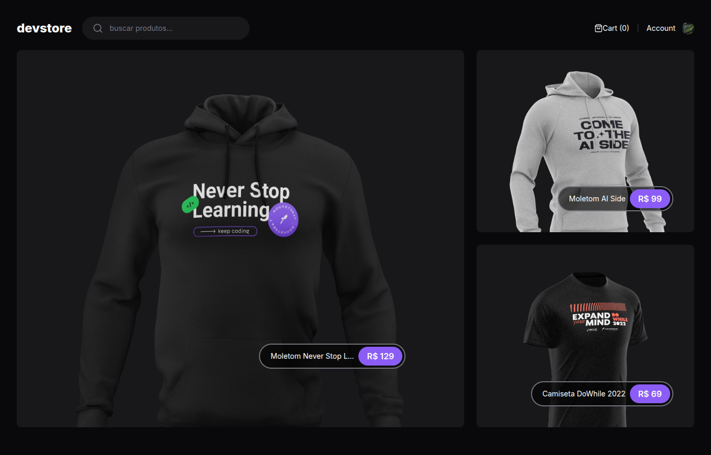

<div align="center">
  
</div>

# DevStore

An e-commerce storefront for developer products, built with Next.js and Stripe.

<strong><a href="https://devstorerdz.netlify.app/">Live Demo →</a></strong>

<div align="center">
  
</div>

[](https://nextjs.org/)
[](https://www.typescriptlang.org/)
[](https://tailwindcss.com/)
[](https://stripe.com/)
[](https://www.cypress.io/)
[](./LICENSE)

---

<p align="center">
  [](https://github.com/rafaumeu/ecommerce-next/generate)
</p>


## Screenshots

<!-- Add screenshot here -->

---

## Features

- 🛒 **Shopping cart** — add, remove, and update items with persistent state
- 🔍 **Product search** — real-time search with server-side filtering
- 💳 **Stripe checkout** — secure payment processing
- 📱 **Responsive layout** — works on mobile, tablet, and desktop
- 🖼️ **Optimized images** — Next.js Image component with lazy loading
- ⚡ **App Router** — Next.js 15 with React Server Components
- 🧪 **E2E tests** — Cypress test suite running on CI

---

## Tech Stack

| Layer | Technology |
|-------|-----------|
| Framework | [Next.js 15](https://nextjs.org/) (App Router) |
| Language | [TypeScript 5](https://www.typescriptlang.org/) |
| Styling | [Tailwind CSS 3](https://tailwindcss.com/) |
| Payments | [Stripe](https://stripe.com/) |
| Validation | [Zod](https://zod.dev/) |
| Icons | [Lucide React](https://lucide.dev/) |
| Testing | [Cypress](https://www.cypress.io/) |
| Linting | [ESLint](https://eslint.org/) + Rocketseat config |

---

## Project Structure

```
ecommerce-next/
├── cypress/                    # E2E test specs
├── src/
│   ├── app/
│   │   ├── (store)/            # Store route group
│   │   │   ├── (home)/         # Home page
│   │   │   ├── product/[slug]/ # Product detail page
│   │   │   └── search/         # Search results page
│   │   ├── api/
│   │   │   └── products/       # Product API routes
│   │   ├── globals.css
│   │   └── layout.tsx
│   ├── components/             # React components
│   ├── contexts/               # React Context providers
│   ├── data/                   # Types and data definitions
│   └── env.ts                  # Environment variable validation
├── public/                     # Static assets
├── cypress.config.ts
├── next.config.js
├── tailwind.config.ts
└── tsconfig.json
```

---

## Getting Started

### Prerequisites

- Node.js 18+
- Yarn (or npm)

### Installation

```bash
# Clone the repository
git clone https://github.com/rafaumeu/ecommerce-next.git

# Enter the project directory
cd ecommerce-next

# Install dependencies
yarn install

# Set up environment variables
cp .env.example .env.local

# Start the dev server
yarn dev
```

Open [http://localhost:3000](http://localhost:3000) in your browser.

---

## Environment Variables

| Variable | Description |
|----------|-------------|
| `NEXT_PUBLIC_API_BASE_URL` | API base URL for product data |
| `APP_URL` | Application public URL |

Create a `.env.local` file in the project root:

```env
NEXT_PUBLIC_API_BASE_URL=https://your-api-url.com
APP_URL=http://localhost:3000
```

---

## Scripts

| Command | Description |
|---------|-------------|
| `yarn dev` | Start development server |
| `yarn build` | Build for production |
| `yarn start` | Start production server |
| `yarn lint` | Run ESLint |

---

## Testing

This project uses Cypress for end-to-end testing. Tests run automatically on every push via GitHub Actions.

```bash
# Run Cypress in headless mode
npx cypress run

# Open Cypress interactive runner
npx cypress open
```

---

## Contributing

1. Fork the repository
2. Create a feature branch (`git checkout -b feature/my-feature`)
3. Commit your changes (`git commit -m 'Add my feature'`)
4. Push to the branch (`git push origin feature/my-feature`)
5. Open a Pull Request

---

## License

This project is licensed under the MIT License. See the [LICENSE](./LICENSE) file for details.

---

<p align="center">
  <a href="https://www.linkedin.com/in/rafaumeu/">
    
  </a>
  <a href="https://github.com/rafaumeu">
    
  </a>
</p>

<div align="center">
  
  <br/><sub>Built with ❤️ by <a href="https://github.com/rafaumeu">Rafael Zendron</a></sub>
</div>